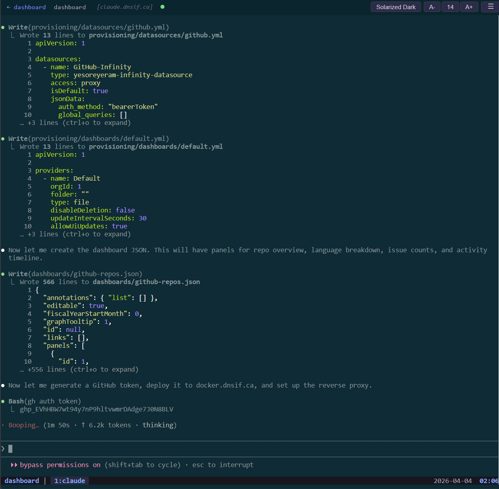
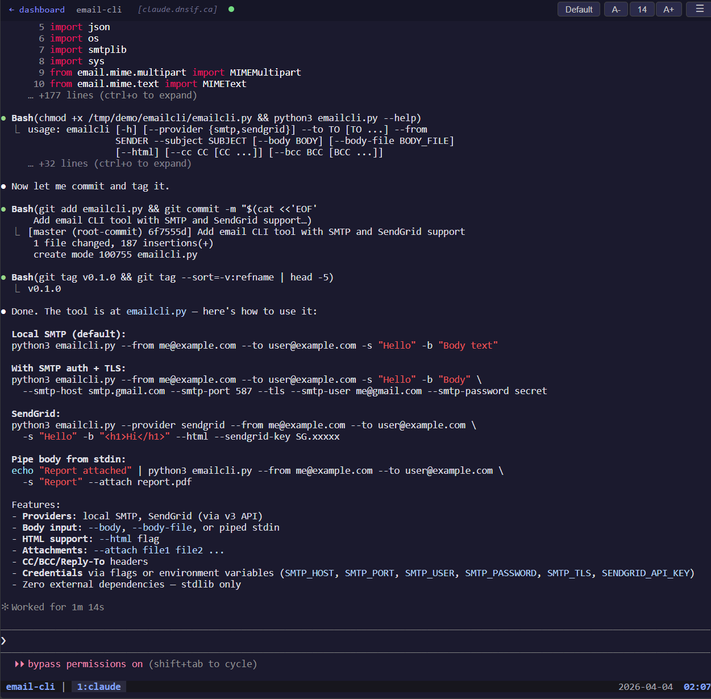
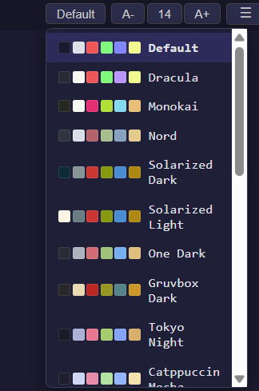
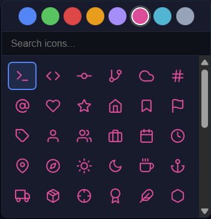
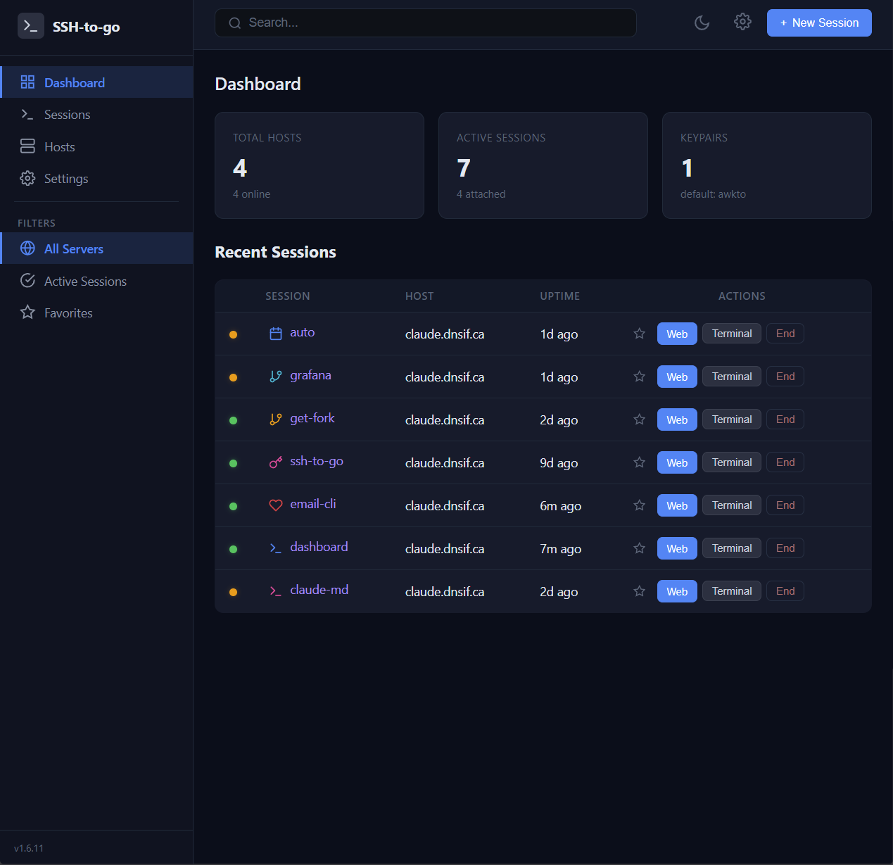
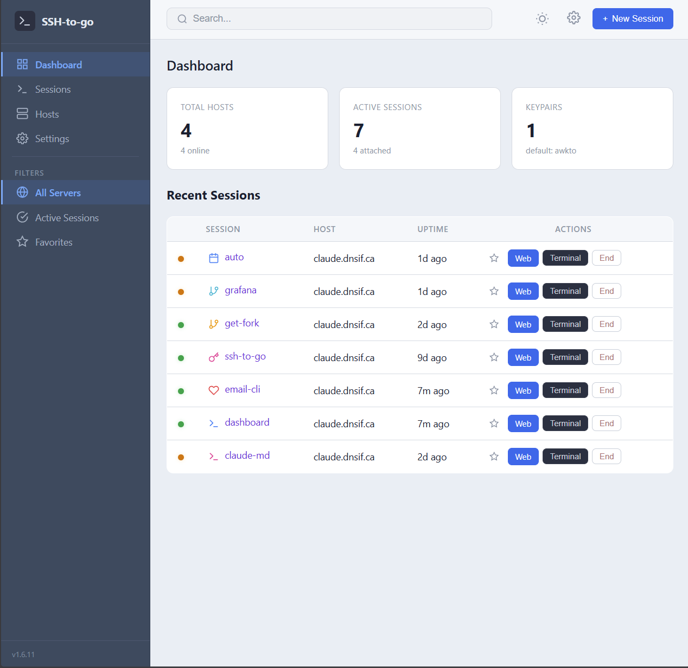

# ssh-to-go

**Your terminal sessions, anywhere.** A web-based tmux session manager that lets you access persistent terminal sessions from any device with a browser — no agents, no plugins, single binary.

> Tired of having your Claude Code or Codex session interrupted every time your PC reboots or updates? Switching between your home PC and work laptop and losing your flow? Don't want to be glued to your desk while vibe coding?
>
> **ssh-to-go** keeps your sessions alive on the server. Pick up exactly where you left off — from another computer, your phone on the bus, or anywhere with a web browser.

<video src="screenshots/demo.mp4" autoplay loop muted playsinline width="100%"></video>

---

## Why ssh-to-go?

- **Never lose a session again** — tmux sessions live on the target machine and survive reboots, network drops, and browser closes
- **Work from anywhere** — attach from your desktop, laptop, tablet, or phone — all you need is a browser
- **AI coding sessions that don't quit** — run Claude Code, Codex, or any long-running terminal process in tmux and check in from wherever you are
- **Multi-device, multi-user** — multiple browsers can attach to the same session simultaneously
- **Zero setup on targets** — no agents or daemons to install, just SSH + tmux

---

## Features

### Web Terminal
Full terminal emulation in the browser via xterm.js with WebSocket relay.

<p align="center">
  
  
</p>

- 8+ built-in color themes (Dracula, Nord, Monokai, Solarized, Gruvbox, and more)
- Automatic terminal resize
- Binary data streaming for responsive I/O
- SSH keepalive prevents idle timeouts

<p align="center">
  
  
</p>

### Dashboard
See all tmux sessions across all your hosts at a glance.

<p align="center">
  
  
</p>

- Real-time host status (online/offline) with OS detection
- Session search and filtering by host, status, favorites
- Star/favorite sessions for quick access
- Customizable icons and colors per session
- Dark and light themes

### Session Management
- **Create** new tmux sessions with optional working directory
- **Rename** sessions without interrupting running processes
- **Kill** sessions from the UI
- **Handoff** — copy a direct `ssh ... tmux attach` command to your clipboard

### Host Management
- Add, edit, and remove hosts at runtime from the web UI
- Per-host SSH port, username, and keypair assignment
- Manual or automatic polling (configurable interval)

### SSH Key Management
- Generate ed25519 keypairs or import existing keys
- Multiple keypairs with default and per-host assignment
- Public key display for easy `authorized_keys` setup

### Authentication
- Password-based login with bcrypt hashing
- 7-day browser sessions
- Named API tokens for programmatic access
- First-run setup wizard
- Optional auth bypass for trusted networks

---

## Quick Start

### Binary

```bash
go build -o ssh-to-go .
./ssh-to-go
```

Open `http://localhost:8080`. The setup wizard walks you through password and SSH key setup on first run.

### Docker

```bash
docker run -p 8080:8080 awkto/ssh-to-go
```

#### Volume Mounts

| Mount Point | Contents | Purpose |
|---|---|---|
| `/etc/ssh-to-go/` | `config.yaml` | Host list, listen address, poll interval |
| `/data/` | `keys/`, `settings.json` | SSH keypairs, default username/keypair |

```bash
# Persist everything
docker run -p 8080:8080 \
  -v ./config:/etc/ssh-to-go \
  -v ./data:/data \
  awkto/ssh-to-go

# Fully ephemeral
docker run -p 8080:8080 awkto/ssh-to-go
```

---

## Configuration

Config file is optional — hosts can be added entirely from the web UI.

```yaml
listen_addr: "127.0.0.1:8080"
poll_interval: 5s
data_dir: data

hosts:
  - name: dev-server
    address: 192.168.1.100
    user: deploy

  - name: cloud-vm
    address: cloud.example.com
    user: ubuntu
    key_name: my-deploy-key  # optional, uses default keypair if omitted
```

---

## How It Works

```
Browser (any device)
    ↕ WebSocket
ssh-to-go server (discovers sessions, relays terminal I/O)
    ↕ SSH
Target machines (tmux sessions live here — persistent, always running)
```

1. The server SSHes into your hosts and polls `tmux list-sessions`
2. The dashboard shows all sessions grouped by host with live status
3. Click a session to attach — xterm.js connects via WebSocket to an SSH relay
4. Sessions live on the target, so they survive anything — reboots, network changes, browser crashes
5. **Handoff** copies the direct SSH command so you can attach from a native terminal anytime

---

## Use Case: Uninterrupted AI Coding

Run Claude Code (or any AI coding tool) inside a tmux session on a server:

```bash
# On your server, start a tmux session
tmux new -s claude-code
claude  # start Claude Code
```

Now attach via ssh-to-go from any browser. Your AI session keeps running even when you:
- Reboot your PC for updates
- Switch from your home desktop to your work laptop
- Check progress on your phone while commuting
- Close your browser and come back hours later

The session never stops. You just reconnect.

---

## Development

```bash
go build -o ssh-to-go . && ./ssh-to-go
```

The web UI is embedded in the binary via `go:embed`. No npm, no build step. xterm.js is vendored in `web/static/vendor/`.

---

## License

[AGPL-3.0](LICENSE)
