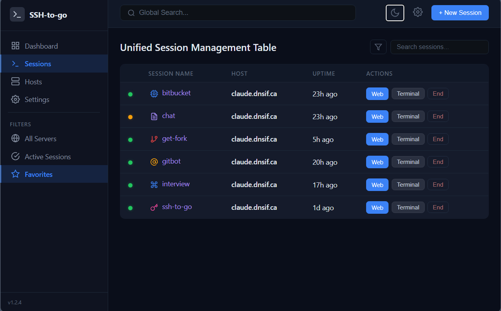
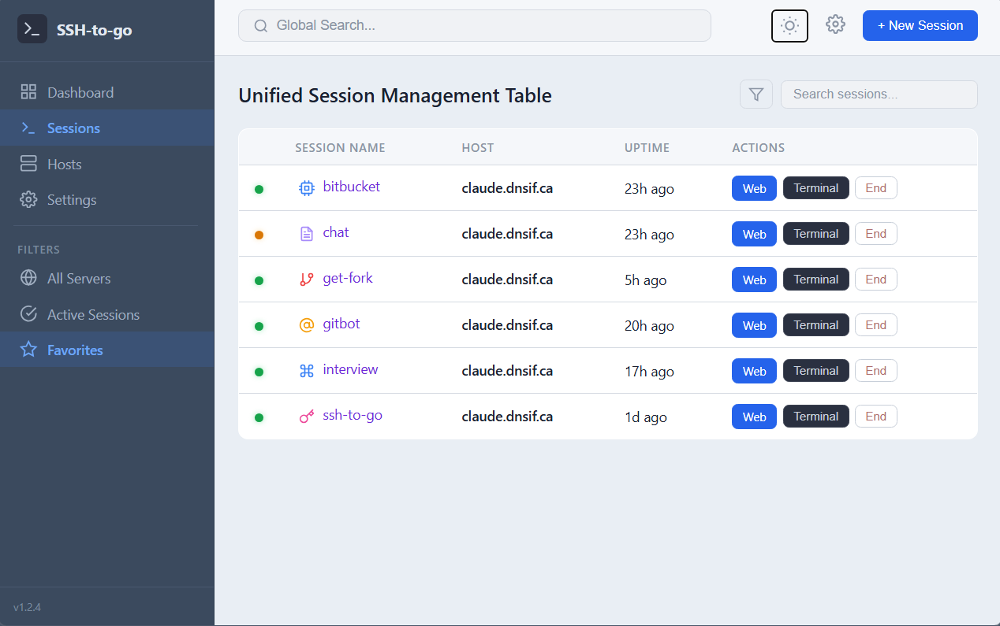

# ssh-to-go

A web-based terminal session manager that discovers and manages tmux sessions across multiple SSH hosts. Single binary, no agents needed on target machines.





- **Web dashboard** — see all sessions across all hosts in one place
- **Browser terminal** — attach to any session via xterm.js
- **Session persistence** — tmux sessions live on the target, survive disconnects
- **Handoff** — copy an SSH command to resume from your terminal
- **Multi-client** — multiple browsers can attach to the same session
- **Key management** — generate, import, and manage SSH keypairs from the UI

See [PURPOSE.md](PURPOSE.md) for the full motivation and architecture vision.

## Quick Start

### Binary

```bash
# Build
go build -o ssh-to-go .

# Run (no config needed — setup wizard on first visit)
./ssh-to-go

# Or with a config file
./ssh-to-go -config config.yaml
```

Open `http://localhost:8080`. On first run you'll be prompted to generate or import an SSH keypair.

### Docker

```bash
docker run -p 8080:8080 awkto/ssh-to-go
```

#### Volume Mounts

Two independent mount points for persistence:

| Mount Point | Contents | Purpose |
|---|---|---|
| `/etc/ssh-to-go/` | `config.yaml` | Host list, listen address, poll interval |
| `/data/` | `keys/`, `settings.json` | SSH keypairs, default username/keypair |

```bash
# Persist everything (config + keys)
docker run -p 8080:8080 \
  -v ./config:/etc/ssh-to-go \
  -v ./keys:/data \
  awkto/ssh-to-go

# Persist config only (keys regenerated on restart)
docker run -p 8080:8080 \
  -v ./config:/etc/ssh-to-go \
  awkto/ssh-to-go

# Fully ephemeral
docker run -p 8080:8080 awkto/ssh-to-go
```

## Configuration

Config file is optional. Hosts can be added from the web UI.

```yaml
listen_addr: "127.0.0.1:8080"
poll_interval: 5s
data_dir: data

hosts:
  - name: dev-server
    address: 192.168.1.100
    user: deploy

  - name: cloud-vm
    address: cloud.example.com
    user: ubuntu
    key_name: my-deploy-key  # optional, uses default keypair if omitted
```

## How It Works

```
Browser / Terminal
    ↕ attach/detach
ssh-to-go server (discovers sessions, relays terminal)
    ↕ SSH
Target machines (tmux sessions live here)
```

1. The server SSHes into your hosts and runs `tmux list-sessions` to discover sessions
2. The web dashboard shows all sessions grouped by host
3. Click to attach — xterm.js in the browser connects via WebSocket to an SSH relay
4. Sessions live on the target machines, so you can always `ssh` in directly and `tmux attach`
5. The "Handoff" button copies the direct SSH command to your clipboard

## SSH Keys

On first run, the setup wizard lets you either:

- **Generate** a new ed25519 keypair (add the public key to `~/.ssh/authorized_keys` on your targets)
- **Import** an existing private key (paste PEM or point to a file path on the server)

Manage multiple keypairs from the Settings page. Set a default keypair and default username globally, or assign specific keypairs per host.

## Development

```bash
go build -o ssh-to-go . && ./ssh-to-go
```

The web UI is embedded in the binary via `go:embed`. No npm, no build step. xterm.js is vendored in `web/static/vendor/`.

## License

[AGPL-3.0](LICENSE)
