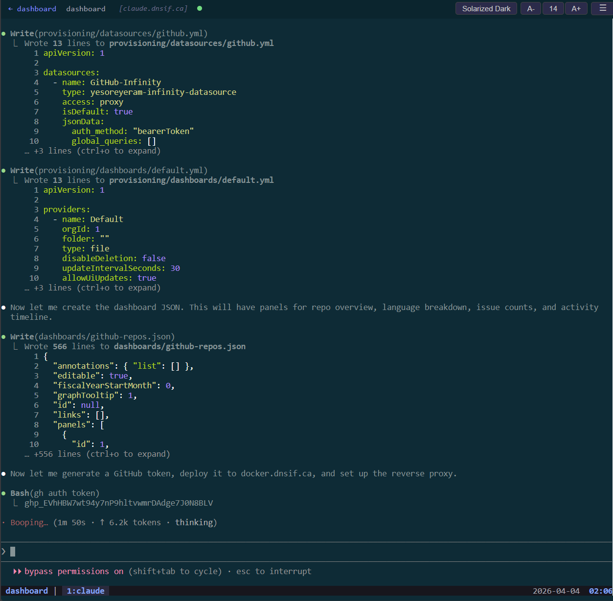
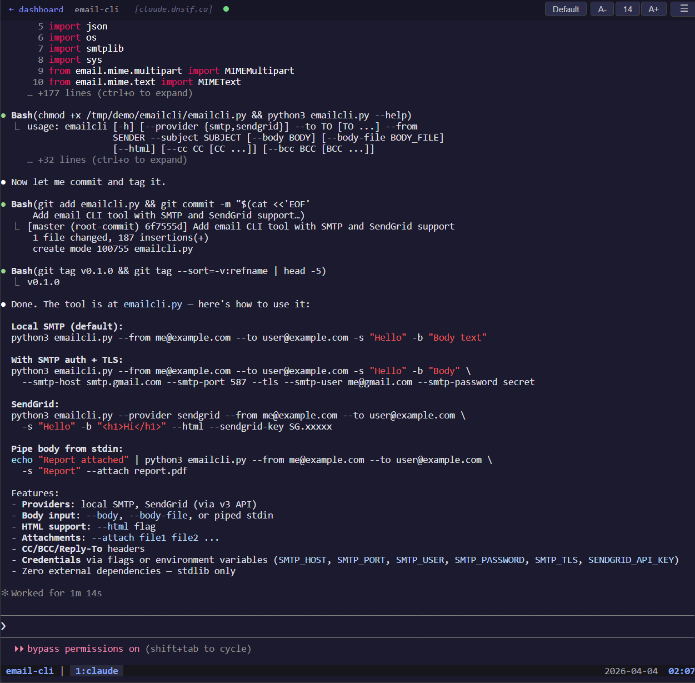

# ssh-to-go

**Your terminal sessions, anywhere.** A web-based tmux session manager that lets you access persistent terminal sessions from any device with a browser — no agents, no plugins, single binary.

> Tired of having your Claude Code or Codex session interrupted every time your PC reboots or updates? Switching between your home PC and work laptop and losing your flow? Don't want to be glued to your desk while vibe coding?
>
> **ssh-to-go** keeps your sessions alive on the server. Pick up exactly where you left off — from another computer, your phone on the bus, or anywhere with a web browser.


https://github.com/user-attachments/assets/121820de-ce71-42c9-be3b-66e05ba05477


---

## Why ssh-to-go?

- **Never lose a session again** — tmux sessions live on the target machine and survive reboots, network drops, and browser closes
- **Work from anywhere** — attach from your desktop, laptop, tablet, or phone — all you need is a browser
- **AI coding sessions that don't quit** — run Claude Code, Codex, or any long-running terminal process in tmux and check in from wherever you are
- **Multi-device, multi-user** — multiple browsers can attach to the same session simultaneously
- **Zero setup on targets** — no agents or daemons to install, just SSH + tmux

---

## Features

### Web Terminal
Full terminal emulation in the browser via xterm.js with WebSocket relay.


<p align="center">
  
  
</p>

- 8+ built-in color themes (Dracula, Nord, Monokai, Solarized, Gruvbox, and more)
- Automatic terminal resize
- Binary data streaming for responsive I/O
- SSH keepalive prevents idle timeouts


### Dashboard
See all tmux sessions across all your hosts at a glance.


- Real-time host status (online/offline) with OS detection
- Session search and filtering by host, status, favorites
- Star/favorite sessions for quick access
- Customizable icons and colors per session
- Dark and light themes

### Session Management
- **Create** new tmux sessions with optional working directory and launch command
- **Rename** sessions without interrupting running processes
- **Kill** sessions from the UI or the web terminal's menu
- **Offload / Recreate** — stop a session to free memory on the host, then bring it back
  later in the same working directory, running the same launch command
- **Duplicate** — a second session beside this one (`foo` → `foo-COPY` → `foo-COPY2`), in
  the directory it's in now and with the same launch command
- **Auto-sleep** — optionally offload sessions that have had no client attached and
  nothing running for a day or more; mark a session *keep awake* to exempt it
- **Handoff** — copy a direct `ssh ... tmux attach` command to your clipboard. Sessions get
  tmux's per-session mouse mode so the wheel scrolls in a native terminal (hold Shift to
  click-drag with the terminal's own selection instead of tmux copy-mode); set
  `"native_mouse_mode": false` in `settings.json` to opt out

### Host Management
- Add, edit, and remove hosts at runtime from the web UI
- Per-host SSH port, username, and keypair assignment
- Manual or automatic polling (configurable interval)

### SSH Key Management
- Generate ed25519 keypairs or import existing keys
- Multiple keypairs with default and per-host assignment
- Public key display for easy `authorized_keys` setup

### Authentication
- Password-based login with bcrypt hashing
- 7-day browser sessions
- Named API tokens for programmatic access
- First-run setup wizard
- Optional auth bypass for trusted networks

### Command Execution API
Run a one-off shell command on a host and poll for the result by id — handy
for scripts, other apps, and LLM agents that need quick access to an internal
shell (e.g. curling an internal page, or running `claude -p "..."`
non-interactively). The command runs in a throwaway, detached tmux session, so
long tasks keep running after the request returns.

```bash
# Launch (host optional — falls back to the default/only host).
# wait_seconds long-polls: short commands return their full result in one call.
curl -sX POST https://ssh.example/api/exec \
  -H "Authorization: Bearer $TOKEN" \
  -d '{"command":"curl -s http://internal-service/health","timeout_seconds":30,"wait_seconds":10}'
# → { "status": "finished", "exit_code": 0, "stdout": "...", "stderr": "", ... }

# Long jobs return 202 { "id": "...", "status": "running" } — poll by id.
# Query params: output=false, tail_lines=N, max_output_bytes=N, wait_seconds=N.
curl -s "https://ssh.example/api/exec/<id>?tail_lines=50" -H "Authorization: Bearer $TOKEN"

# Raw output as text/plain (stream=out|err).
curl -s "https://ssh.example/api/exec/<id>/output?stream=err" -H "Authorization: Bearer $TOKEN"

# Stop a running job (its process group gets SIGTERM; ?force=true adds SIGKILL).
curl -sX DELETE "https://ssh.example/api/exec/<id>" -H "Authorization: Bearer $TOKEN"

# List jobs. ?remote=true scans the host's job dir (survives server restarts).
curl -s "https://ssh.example/api/exec?remote=true" -H "Authorization: Bearer $TOKEN"
```

Launch options: `host`, `timeout_seconds` (default 3600, exit 124 on expiry
with SIGKILL escalation; an explicit `0` disables the timeout), `cwd`
(validated, launch fails if missing), `env` (object; written to a private file
on the host, never inlined into the command — use it for tokens), `stdin`
(string; otherwise stdin is `/dev/null`), `wait_seconds` (max 60).

`status` is `running`, `finished` (always with `exit_code`), `crashed` (the
runner died without recording an exit code — reported as `exit_code: -1`, never
as success), or `gone` (job dir no longer on the host). Output is returned as
separate `stdout`/`stderr`, capped at 256 KB per stream by default, with
`stdout_bytes`/`stderr_bytes` totals and a `truncated` flag.

Set a default host for host-less requests under **Settings → default host**
(`default_host` in `settings.json`).

### CLI Client (`stogo`)

A small native client for Linux/macOS that talks to the same API as the dashboard:

```bash
stogo auth login          # point it at your server (password → API token)
stogo list                # sessions, most recently active first (-a: sort by name)
stogo new bug hunt        # create a session (quick-confirm prompts; alias: stogo create)
stogo connect mysession   # attach in your real terminal (alias: stogo c)
stogo connect 3           # ...or use the short ID from `stogo list`
stogo offload mysession   # stop a session but keep it resumable
stogo kill mysession      # kill a session
stogo status              # server/host summary
```

`stogo connect` is deliberately thin: it fetches the server's handoff command and
execs it, so your local `ssh` and the target host's `tmux` do all the work — no
custom terminal emulation. You need SSH access to the target host and `tmux`
installed there (which ssh-to-go already requires).

`stogo new` is three prefilled prompts — directory, launch command, connect
now? — where Enter accepts, so a repeat run is name + Enter-Enter-Enter:

```
$ stogo new bug hunt
session: bug-hunt (on pro)
dir     [~/sessions/bug-hunt]: ⏎
command [claude -n $name] ('-' for none): ⏎
connect now? [Y/n] ⏎
created pro/bug-hunt — attaching…
```

The host is never asked in the common case (`-host` flag → remembered pick →
server default host → the sole host). The directory derives from the server's
new-session directory setting plus a slug of the name — the same path the web
form would use — and `$name`/`$date` expand server-side with the same rules.
The launch command and the connect-or-not answer are remembered across runs
(first run seeds the command from the dashboard's recent-commands list);
remembered defaults live in the `"new"` section of the config file and can be
edited there directly. Flags answer any prompt ahead of time (`-host`, `-dir`,
`-cmd` with `-` meaning none, `-attach`/`-bg`), and `-y` — implied when stdin
isn't a terminal — accepts every default unprompted, so
`stogo new -y quick fix` is scriptable.

Install from a [GitHub release](https://github.com/awkto/ssh-to-go/releases)
(`stogo-linux-amd64`, `stogo-darwin-arm64`, … or the `sshtogo` .deb), or:

```bash
curl -fsSL https://raw.githubusercontent.com/awkto/ssh-to-go/main/scripts/install-cli.sh | bash
```

Config lives in `~/.config/stogo/config.json`; `STOGO_URL`/`STOGO_TOKEN`
environment variables override it for headless use. Sessions are addressed as
`NAME`, `HOST/NAME` when the same name exists on several hosts, or the short
numeric ID shown by `stogo list`. IDs are assigned by the server (3-4 digits,
unique across all hosts), so the same session has the same ID in every
client, on every machine, for as long as it lives — surviving renames and
offload/recreate.

Tab completion for subcommands **and session names** ships with the .deb; for
other installs add `source <(stogo completion bash)` to your `~/.bashrc`.

### Android App

A native Android client for on-the-go access. Download the APK from a
[GitHub release](https://github.com/awkto/ssh-to-go/releases) tagged with
`android-v*`.

Connect by entering your server URL and an API token (created in Settings →
API Tokens on the web UI). The app supports the full session dashboard with
tap-to-open terminals, custom color palettes per session, and most-recently-used
sorting. See `android/README.md` for build and architecture details.

### MCP Server (interactive TUIs)

An MCP server (SSE at `/mcp/sse`, docs at `/mcpdocs`, enable it in Settings)
exposes the session/host/exec tools to AI clients, plus tools for driving a
**long-lived interactive tmux session** — a Claude Code TUI, `vim`, `psql`, a
REPL — over a single tmux pane:

- **`create_session`** — MCP-created sessions default to a roomy **200x50**
  pane (agents drive a TUI, not a phone); override with `width`/`height`, and
  set `history_limit` for deeper scrollback.
- **`send_keys`** — type into a session. Literal `text` is hex-encoded and
  typed *exactly* (a prompt containing the word "Enter" or "C-c" is typed, not
  executed); `keys` are tmux key names (`Enter`, `Escape`, `C-c`, `Up`, …). The
  submitting Enter is sent as a **separate** keystroke after `submit_delay_ms`
  (default 120) — Ink/React TUIs like Claude Code drop the submit if text+Enter
  arrive in one burst.
- **`read_pane`** — capture the pane (ANSI stripped by default). Returns a
  content-hash `cursor`; pass it back as `since` to get `{changed:false}` with
  an empty body while a TUI is mid-render. Capped at 256 KB (tail kept).
- **`wait_for_pane`** — block **server-side** (one round trip) until the pane
  goes `idle` (unchanged for `quiet_ms`) or a `pattern` regex matches, then
  return the pane. A `timeout_seconds` (default 120, max 600) elapse is a normal
  return (`reason:"timeout"`) with the current content, not an error.

End-to-end (create → type → wait → read):

```text
create_session(name:"cc", width:200, height:50)
send_keys(session:"cc", text:"echo hi")     # types the text, then a separate Enter
wait_for_pane(session:"cc", until:"idle")   # returns when the pane settles
read_pane(session:"cc")                      # → { changed, content, cursor }
```

Errors follow the structured `{code, error, retryable}` contract (e.g.
`SESSION_NOT_FOUND` is `retryable:false`). These tools run commands as a
root-equivalent user — intended for interactive/human-driven use, not
unattended webhooks.

#### Job execution environment (the contract)

Jobs run in a deliberately minimal, non-interactive environment — closer to a
CI runner than to your login shell:

- **Shell:** `bash`, non-interactive. No `~/.bashrc`, `~/.profile`, or
  `~/.bash_profile` is sourced, so aliases, functions, and env vars from your
  profile (e.g. `ANTHROPIC_API_KEY`) are **not** present. Pass what you need
  via `env`.
- **PATH:** the system default plus `$HOME/.local/bin` and `$HOME/bin`
  prepended. Version-manager shims (`nvm`, `mise`, `~/.cargo/bin`) are not
  loaded — if "it works over SSH but not via exec", it's almost always PATH;
  use an absolute path or set `PATH` via `env`.
- **stdin:** `/dev/null` (or your `stdin` string). Prompting commands
  (`apt install` without `-y`, `git` asking for credentials) get EOF and fail
  fast instead of hanging.
- **stdout/stderr:** captured to files; not a TTY, so no ANSI color or
  progress-bar output.
- **cwd:** `$HOME` unless `cwd` is given.
- **Lifetime:** the whole process group is killed when the job ends or times
  out. To deliberately outlive the job, `setsid` your daemon.
- **Artifacts:** command, output, and exit code live in
  `~/.ssh-to-go/exec/<id>/` on the host (mode `0700`/`0600`), and are
  garbage-collected 24h after completion.

---

## Quick Start

### Binary

```bash
go build -o ssh-to-go .
./ssh-to-go
```

Open `http://localhost:8080`. The setup wizard walks you through password and SSH key setup on first run.

### Docker

```bash
docker run -p 8080:8080 awkto/ssh-to-go
```

#### Volume Mounts

| Mount Point | Contents | Purpose |
|---|---|---|
| `/etc/ssh-to-go/` | `config.yaml` | Host list, listen address, poll interval |
| `/data/` | `keys/`, `settings.json` | SSH keypairs, default username/keypair |

```bash
# Persist everything
docker run -p 8080:8080 \
  -v ./config:/etc/ssh-to-go \
  -v ./data:/data \
  awkto/ssh-to-go

# Fully ephemeral
docker run -p 8080:8080 awkto/ssh-to-go
```

See `docker-config.yaml` in the repository for a working Docker config example.
Note: the `data_dir` must be set to `/data` to match the mounted volume.

---

## Configuration

Config file is optional — hosts can be added entirely from the web UI.

```yaml
listen_addr: "127.0.0.1:8080"
poll_interval: 5s
data_dir: data

hosts:
  - name: dev-server
    address: 192.168.1.100
    user: deploy

  - name: cloud-vm
    address: cloud.example.com
    user: ubuntu
    key_name: my-deploy-key  # optional, uses default keypair if omitted
```

---

## How It Works

```
Browser (any device)
    ↕ WebSocket
ssh-to-go server (discovers sessions, relays terminal I/O)
    ↕ SSH
Target machines (tmux sessions live here — persistent, always running)
```

1. The server SSHes into your hosts and polls `tmux list-sessions`
2. The dashboard shows all sessions grouped by host with live status
3. Click a session to attach — xterm.js connects via WebSocket to an SSH relay
4. Sessions live on the target, so they survive anything — reboots, network changes, browser crashes
5. **Handoff** copies the direct SSH command so you can attach from a native terminal anytime

---

## Use Case: Uninterrupted AI Coding

Run Claude Code (or any AI coding tool) inside a tmux session on a server:

```bash
# On your server, start a tmux session
tmux new -s claude-code
claude  # start Claude Code
```

Now attach via ssh-to-go from any browser. Your AI session keeps running even when you:
- Reboot your PC for updates
- Switch from your home desktop to your work laptop
- Check progress on your phone while commuting
- Close your browser and come back hours later

The session never stops. You just reconnect.

---

## Development

```bash
go build -o ssh-to-go . && ./ssh-to-go
```

The web UI is embedded in the binary via `go:embed`. No npm, no build step. xterm.js is vendored in `web/static/vendor/`.

---

## License

[AGPL-3.0](LICENSE)
